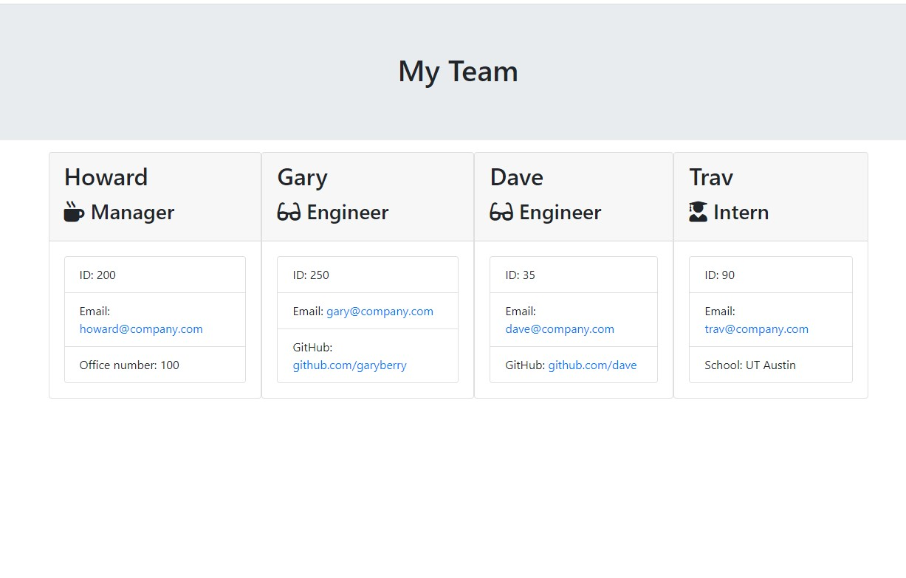
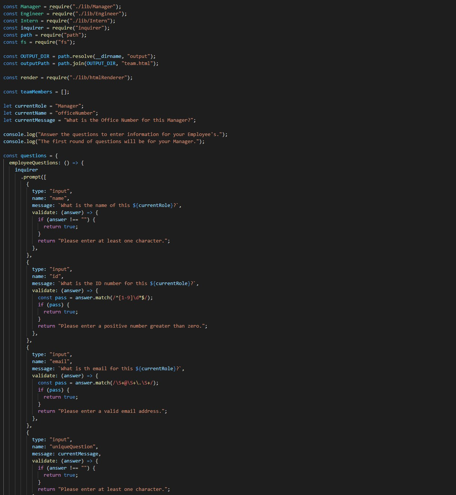
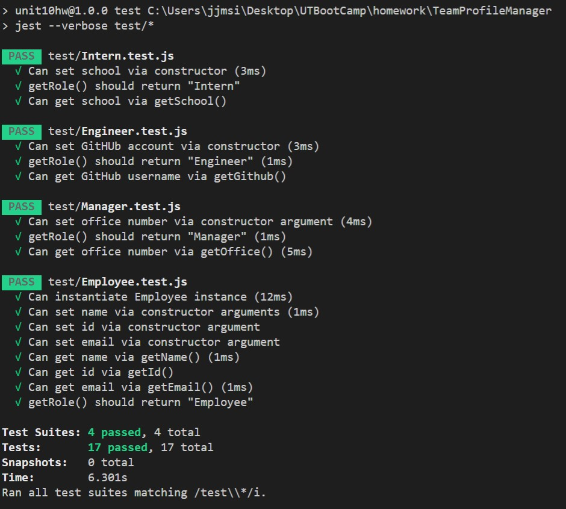

# Employee Team Summary
[](https://opensource.org/licenses/MIT)

## Description

This node.js based program is designed to generate a HTML webpage that displays Manager and all Engineers and Interns for a production team. The user needs to install the required dependencies and then run the program using node from their command line, after that it is as easy as answering the provided questions.

## Table of Contents 

* [Screenshot](#Screenshot)

* [Video](#Video)

* [Installation](#installation)

* [Usage](#usage)

* [License](#license)

* [Contributing](#contributing)

* [Tests](#tests)

* [Questions](#questions)

## Screenshot





## Video

[Video Walkthrough](https://drive.google.com/file/d/126ne6j0bfUKt9ZJVFYOIBacbD9xBtbPL/view)

## Installation

To install necessary dependencies, run the following command:

```
npm i
```

## Usage

Once the user has installed the necessary tools it is as easy to use as typeing "node app.js" into their terminal of choice while in the parent directory and then answering the prompt questions. Once they've answered all the questions and chosed "Print Summary" they can go to the "output" directory and load "team.html" into their browser to see the finished product.

## License

- MIT

- https://opensource.org/licenses/MIT
  
## Contributing

This would not have been possible without the help of my tutor Kumar Ramanathan, my instructor Calvin Carter, all of the class TA's including Sean Belverstone, Daniel Vega, and Brennan Predmoré, and many of my fellow UT Bootcamp students.

## Tests

To run tests, run the following command:

```
npm test
```

## Questions

If you have any questions about the repo, open an issue or contact me through the contact form on my portfolio website: https://joey-sisk.github.io/Portfolio/. You can find more of my work at [Joey Sisk](github.com/joey-sisk).
# browserGame
